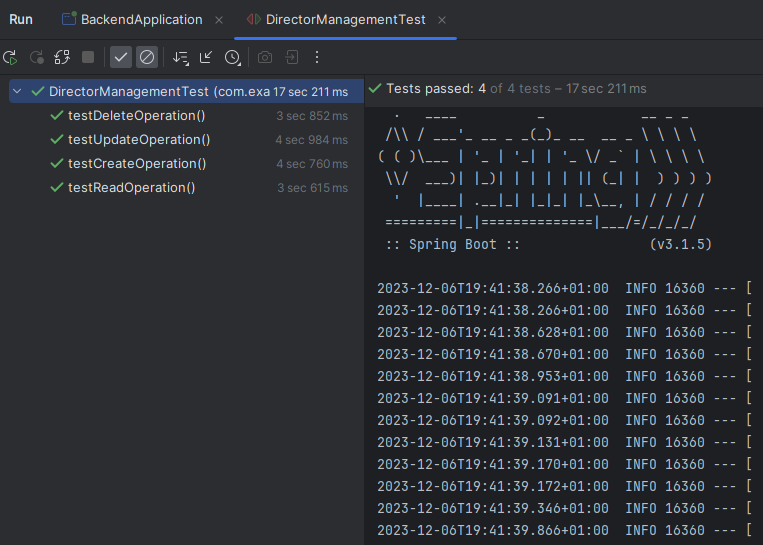
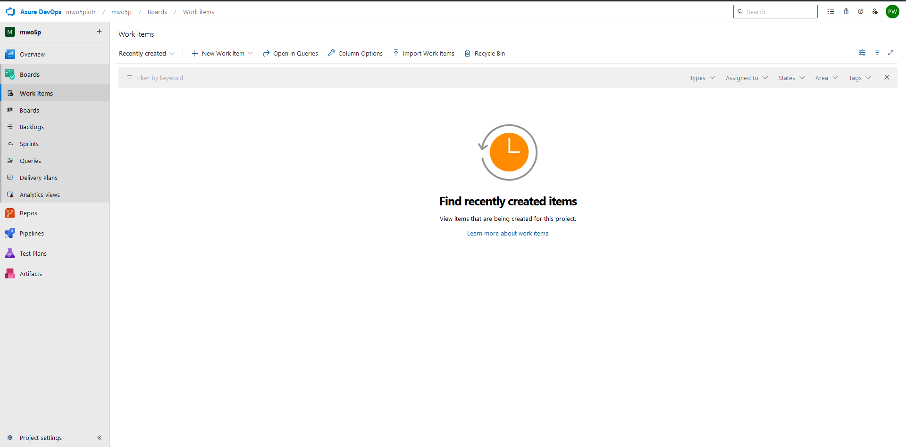
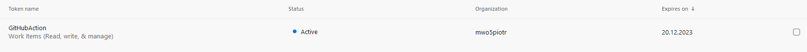
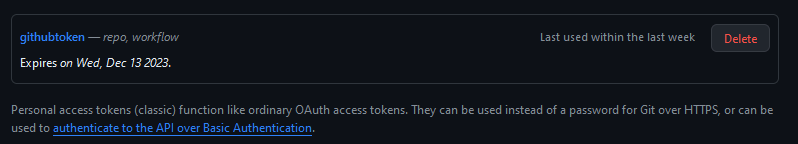
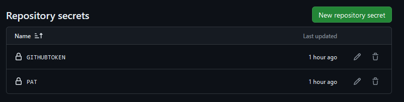
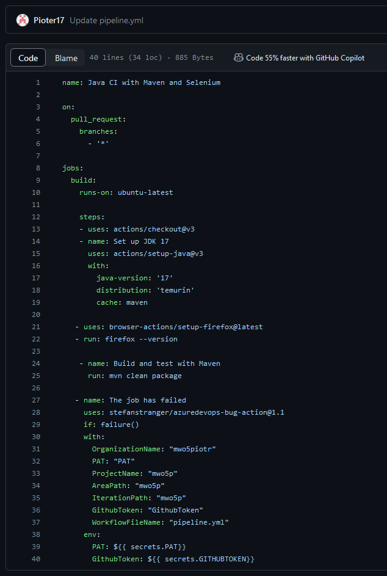
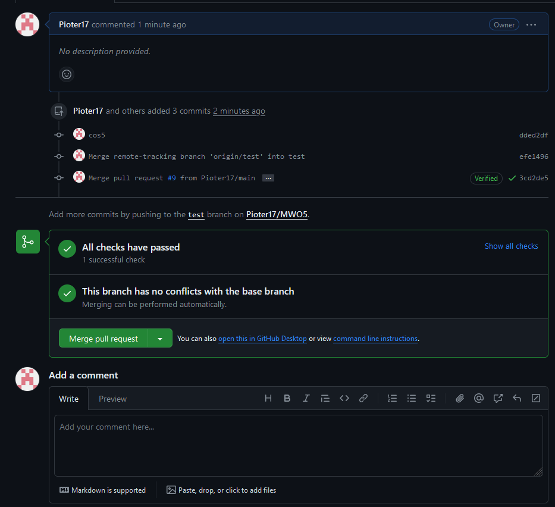
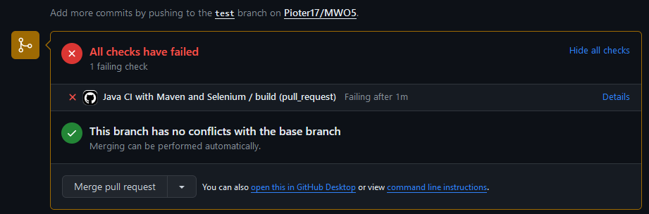
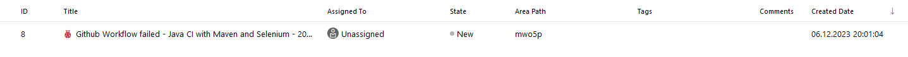
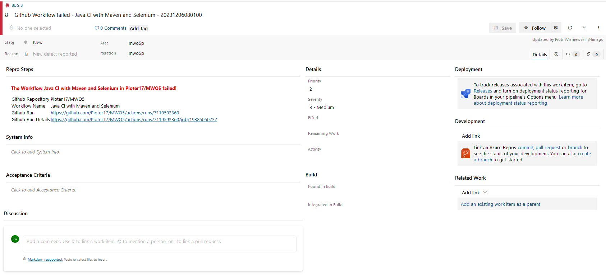

# Projekt - MWO5 - Instrukcja


# Uruchomienie

Żeby uruchomić program należy mieć zainstalowaną javę 17 oraz maven. Do uruchomienia służy komenda
```copyable
mvn spring-boot:run
```
Do zbudowania aplikacji służy polecenie 
```copyable
mvn clean package
```
Do uruchomienia testów służy komenda
```copyable
mvn test
```

# Aplikacja

Po uruchomieniu aplikacji można ją zobaczyć pod adresem ```http://localhost:8080/index.html```. Zawiera ona wszystkie wymagane funkcje, tj. umożliwia wykonanie operacji CRUD - tworzenia, odczytywania, zmiany oraz usuwania rekordu.

# Testy Selenium

Poniżej przedstawiam zdjęcie działających testów


# Konfiguracja Azure DevOps

Poniżej przedstawiam skonfigurowanie projektu oraz ustawienie osobistego tokena na platformie Azure DevOps.




# Konfiguracja GitHub Actions

Ustawienie osobistego tokena na githubie oraz zapisanie secretów tj. tokena z githuba oraz azure.




# Działanie integracji GitHub Actions z Azure DevOps

Plik pipeline.yml


Pull request gdy testy przechodzą (nie generuje raportu o błędzie)


Pull request gdy testy nie przechodzą (generuje raport o błędzie)


Raport na platformie Azure DevOps


Szczegóły raportu

